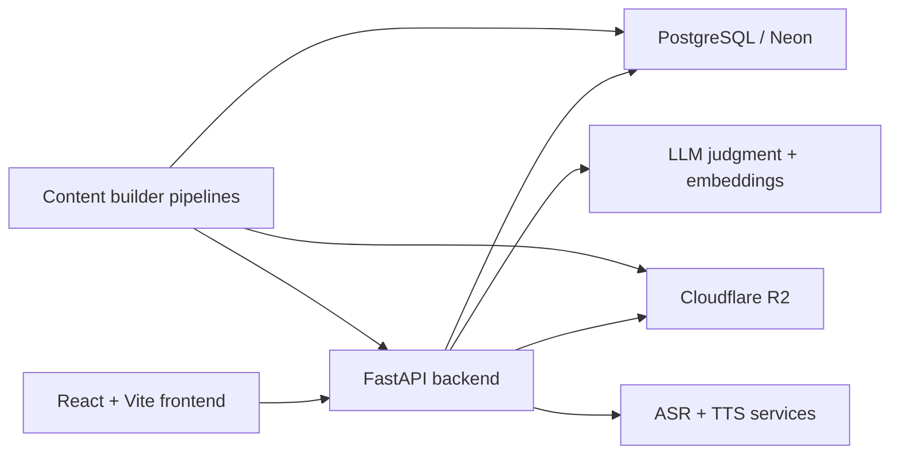

<p align="center">
  
</p>

<h1 align="center">Chilan</h1>

<p align="center">
  <strong>AI-powered, course-based language learning with structured lessons, semantic answer evaluation, speech practice, and FSRS review.</strong>
</p>

<p align="center">
  <a href="./README.md">English</a> · <a href="./README.zh.md">简体中文</a>
</p>

<p align="center">
  
</p>

## Overview

Chilan is an AI-powered, course-based language learning platform built around structured Chinese, English, and Japanese study tracks. This repository combines a learner-facing web app, a FastAPI backend, and an offline content pipeline that turns lesson source material into JSON, audio, slides, and published learning assets.

Instead of relying on rigid exact-match grading alone, Chilan uses a three-tier evaluation system: exact or pattern matching first, embedding similarity second, and LLM judgment last. That keeps the feedback loop fast for obvious cases while preserving nuance when a learner answer is semantically close, ambiguous, or genuinely wrong.

## Why Chilan

Traditional language-learning products are strong at template checking but weak at nuance. If a learner gives the right idea with different wording, many apps reject it too early. Chilan is designed to reduce that false-negative problem without turning every answer into an expensive LLM call.

In practice, that means the platform can:

- stay fast when an answer is obviously correct,
- catch semantically aligned answers that do not match the template exactly,
- and provide richer feedback only when deeper judgment is actually needed.

## Core highlights

### 1) Three-tier answer evaluation

| Tier | What it does | Why it matters |
| --- | --- | --- |
| Tier 1 | Regex / pattern matching | Accepts obvious exact or normalized answers quickly |
| Tier 2 | Embedding similarity | Catches semantically aligned answers beyond string matching |
| Tier 3 | LLM judgment | Produces nuanced decisions and feedback when earlier tiers are not enough |

### 2) Structured learning flow

- Course-based study instead of unstructured prompt chatting
- Teaching → practice / review → completion flow
- Lesson progress, review queues, and completion tracking
- Dedicated Chinese foundation pages for **course intro**, **hanzi**, **pinyin**, and **typing**

### 3) Media-backed lessons and speech support

- Audio-backed teaching content
- Pinyin audio, intro audio, teaching narration, and slide media served by the backend
- Speech transcription and text-to-speech support in the learning loop
- Optional explanation video rendering via Remotion-based tooling

### 4) FSRS-based review scheduling

- Review timing is built into the product rather than bolted on afterward
- Due-review queues and classroom / overview progress surfaces
- Stability- and mastery-oriented learning flow

### 5) Multilingual interface

- The current UI language options include **15 interface languages**
- This is interface localization, not a promise that every course exists for every language pair

<details>
<summary>Current interface languages</summary>

- Simplified Chinese
- English
- Japanese
- French
- German
- Korean
- Spanish
- Vietnamese
- Portuguese
- Arabic
- Thai
- Russian
- Indonesian
- Malay
- Italian

</details>

## Course tracks

| Track | Pipeline ID | Focus |
| --- | --- | --- |
| Integrated Chinese | `integrated_chinese` | Structured Chinese lessons for multilingual learners |
| New Concept English | `new_concept_english` | Structured English lessons for Chinese-speaking learners |
| Minna no Nihongo | `minna_no_nihongo` | Structured Japanese lessons for Chinese-speaking learners |

## How learning works

1. **Sign in and enter the classroom**  
   Learners browse courses, enroll, and pick up where they left off.

2. **Study the lesson content**  
   Teaching mode combines lesson structure, audio, and supporting media.

3. **Move into practice or review**  
   The study route switches between teaching, practice, review, completion, and related states.

4. **Submit text or speech answers**  
   Answers go through the three-tier evaluator via `/study/evaluate`.

5. **Review on an FSRS schedule**  
   Due items, progress, and mastery flow back into the classroom and overview surfaces.

## Architecture at a glance



### Tech stack

- **Frontend:** React 19, Vite 7, Tailwind CSS v4, React Router 7, TanStack Query 5, i18next, Framer Motion, Remotion
- **Backend:** FastAPI, Python 3.13, psycopg2, PostgreSQL, Cloudflare R2, speech services, AI-assisted evaluation
- **Content tooling:** Offline lesson generation, narration rendering, slide/video rendering, and publish flows

## Quick start

### Prerequisites

| Tool | Notes |
| --- | --- |
| Python 3.13 | Required for the backend |
| Node.js 20+ | Documented frontend baseline |
| PostgreSQL / Neon-compatible DB | Needed for app data |
| ffmpeg | Only needed for video / content rendering workflows |

### 1) Start the backend

Create `backend/.env` with the project settings you need, then run:

```bash
cd backend
pip install -r requirements.txt
python main.py
```

Backend health check:

```bash
curl http://127.0.0.1:8000/health
```

### 2) Start the frontend

```bash
cd frontend
npm install
npm run dev
```

Useful frontend commands:

```bash
npm run build
npm run lint
npm run preview
```

### 3) Key configuration notes

The repo uses code-backed environment names such as:

| Area | Variables |
| --- | --- |
| Frontend API | `VITE_APP_API_BASE_URL` |
| Frontend Google OAuth | `VITE_AUTH_GOOGLE_CLIENT_ID` |
| Database | `DB_MODE`, `APP_DATABASE_URL`, `APP_DATABASE_URL_LOCAL` |
| JWT | `SECURITY_JWT_SECRET`, `SECURITY_JWT_ALGORITHM`, `SECURITY_ACCESS_TOKEN_EXPIRE_MINUTES` |
| Storage | `STORAGE_R2_ACCOUNT_ID`, `STORAGE_R2_ACCESS_KEY_ID`, `STORAGE_R2_SECRET_ACCESS_KEY`, `STORAGE_R2_BUCKET` |
| Speech | `ASR_PROVIDER`, `ASR_OPENAI_API_KEY` or `LLM_OPENAI_API_KEY` |
| Mail | `MAIL_PROVIDER` plus `MAIL_SMTP_*` or `MAIL_RESEND_*` |

> `backend/.env.example` is not currently checked in, so use the code and docs as the source of truth when setting up local configuration.

## Content pipeline and media tooling

Beyond the live learner app, this repo also contains an offline content system under `backend/content_builder/` for turning source material into publishable lesson assets.

Typical workflows include:

- lesson / JSON publishing
- narration generation
- slide / explanation video rendering
- media upload and sync to PostgreSQL + Cloudflare R2

Useful commands:

```bash
cd backend
python database/sync_to_db.py
```

```bash
cd frontend
node scripts/render-explanation-video.mjs 101
# or
node scripts/render-explanation-video.mjs <lessonId> [lang] [pipelineId]
```

## Repository structure

```text
.
├─ frontend/                 # React/Vite learning app
│  ├─ src/
│  │  ├─ pages/              # Home, auth, classroom, course, study, overview, settings
│  │  ├─ api/                # Axios client and query definitions
│  │  └─ videoTemplates/     # Remotion-based teaching / explanation components
├─ backend/                  # FastAPI API, study services, storage, database sync
│  ├─ routers/               # Auth and study routes
│  ├─ services/              # Evaluation, scheduling, speech, storage, maintenance
│  ├─ database/              # Connection and sync scripts
│  └─ content_builder/       # Offline lesson generation and publishing pipelines
├─ docs/                     # Architecture and development docs
└─ poster/                   # Showcase assets used for project presentation
```

## Documentation map

If you want to go deeper, start here:

- [Docs index](docs/index.md)
- [Project overview](docs/project-overview.md)
- [Development guide](docs/development-guide.md)
- [Frontend architecture](docs/architecture-frontend.md)
- [Backend architecture](docs/architecture-backend.md)
- [Integration architecture](docs/integration-architecture.md)
- [Source tree analysis](docs/source-tree-analysis.md)

> Most deeper technical docs in `docs/` are currently Chinese-first.

## Notes

- This README focuses on the verified current product and repository structure.
- Interface-language support and course availability are not the same thing.
- The project name is standardized here as **Chilan**.
