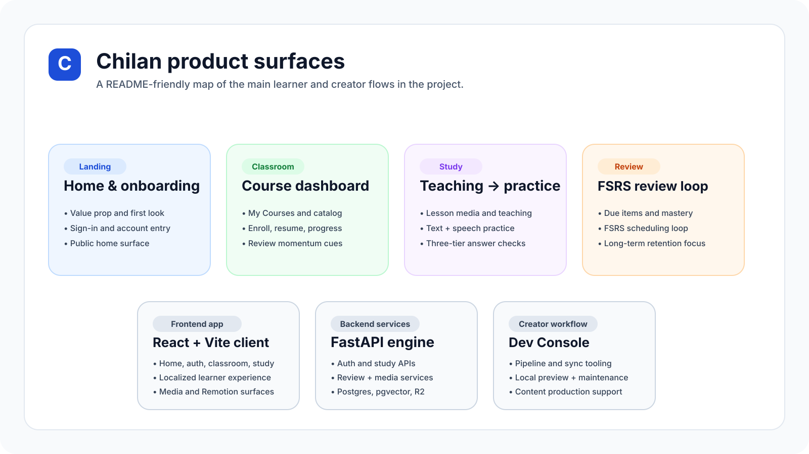
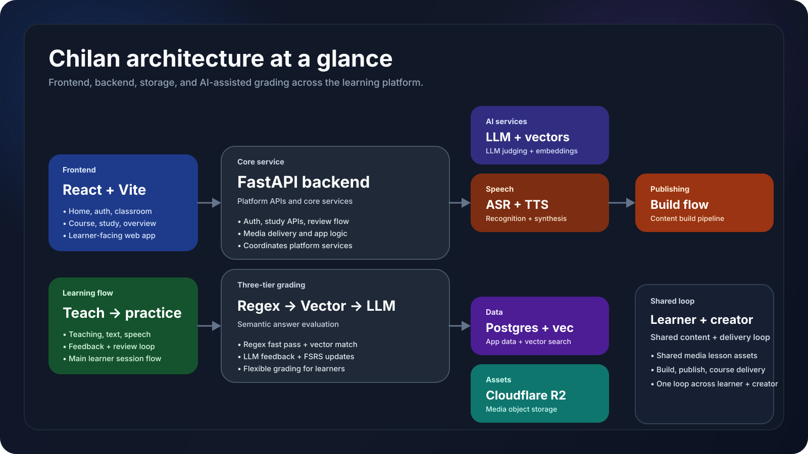

<p align="center">
  
</p>

<h1 align="center">Chilan</h1>

<p align="center">
  <strong>AI-powered, course-based language learning with textbook-structured lessons, semantic answer evaluation, speech practice, and FSRS review.</strong>
</p>

<p align="center">
  <a href="./README.md">English</a> ·
  <a href="./README.zh.md">简体中文</a> ·
  <a href="https://www.chilanlearning.com">Live site</a> ·
  <a href="./docs/index.md">Docs</a> ·
  <a href="./CONTRIBUTING.md">Contributing</a>
</p>

<p align="center">
  
  
  
  
  
  
</p>

## Overview

Chilan is an AI-powered, course-based language learning platform built around structured Chinese, English, and Japanese study tracks. This repository combines a learner-facing web app, a FastAPI backend, public developer docs, and contribution-friendly project metadata.

At the product level, Chilan is designed to solve a familiar learning problem: string-match grading is fast, but often too rigid. Instead of stopping at exact answers, Chilan uses a **three-tier evaluation flow** — regex or normalized matching first, embedding similarity second, and LLM judgment last — so feedback can stay efficient for obvious cases while remaining flexible when answers are semantically close.

## Highlights

<table>
  <tr>
    <td width="50%" valign="top">
      <strong>🧠 Three-tier semantic grading</strong><br />
      Regex and pattern matching for fast wins, embeddings for semantic near-matches, and LLM analysis for nuanced evaluation and feedback.
    </td>
    <td width="50%" valign="top">
      <strong>🔁 FSRS-driven review loop</strong><br />
      Review timing is built into the learning system, with progress, due-item flow, and mastery-oriented reinforcement.
    </td>
  </tr>
  <tr>
    <td width="50%" valign="top">
      <strong>🎙️ Text + speech practice</strong><br />
      Study flow supports typed answers, speech transcription, and TTS-backed learning interactions.
    </td>
    <td width="50%" valign="top">
      <strong>📚 Structured course tracks</strong><br />
      Integrated Chinese, New Concept English, and Minna no Nihongo are modeled as organized study systems rather than open-ended chat prompts.
    </td>
  </tr>
  <tr>
    <td width="50%" valign="top">
      <strong>🖥️ Media-backed lesson delivery</strong><br />
      Teaching slides, narration audio, intro assets, and explanation-video tooling support a richer lesson experience.
    </td>
    <td width="50%" valign="top">
      <strong>🛠️ Local creator workflow</strong><br />
      The project includes local tooling for pipeline execution, sync, maintenance, and preview flows in addition to the live learner app.
    </td>
  </tr>
</table>

## Demo & project visuals

<p>
  Public-facing preview: <a href="https://www.chilanlearning.com">chilanlearning.com</a>
</p>

<table>
  <tr>
    <td align="center" valign="top" width="32%">
      
      <br />
      <sub>Public site preview asset</sub>
    </td>
    <td align="center" valign="top" width="68%">
      
      <br />
      <sub>Tracked README visual summarizing the main product and creator surfaces</sub>
    </td>
  </tr>
</table>

> Note: the public repo currently includes README-oriented visuals under `docs/assets/`. Large generated assets and local-only pipeline outputs remain intentionally untracked.

## Course tracks

| Track | Pipeline ID | Focus |
| --- | --- | --- |
| Integrated Chinese | `integrated_chinese` | Structured Chinese lessons for multilingual learners |
| New Concept English | `new_concept_english` | Structured English lessons for Chinese-speaking learners |
| Minna no Nihongo | `minna_no_nihongo` | Structured Japanese lessons for Chinese-speaking learners |

## How the product works

1. **Enter the classroom**  
   Learners sign in, browse courses, enroll, and resume progress.

2. **Study lesson content**  
   Teaching mode delivers lesson structure, media, and supporting material.

3. **Move into practice or review**  
   The app transitions through teaching, practice, review, completion, and related states.

4. **Submit text or speech answers**  
   Evaluation runs through the three-tier pipeline via the backend study flow.

5. **Return through the review loop**  
   Review scheduling, stability, and progress updates feed back into classroom and overview experiences.

## Architecture at a glance

<p align="center">
  
</p>

### Main building blocks

- **Frontend:** React 19, Vite 7, Tailwind CSS v4, React Router 7, TanStack Query 5, i18next, Framer Motion, Remotion
- **Backend:** FastAPI, Python 3.13, study evaluation services, review scheduling, media delivery
- **Data:** PostgreSQL with pgvector-backed semantic comparison workflows
- **Storage:** Cloudflare R2 for asset delivery patterns used by the platform
- **Broader project workflow:** local content and publishing utilities are part of the working project, while large generated artifacts stay out of version control

## Quick start

### Requirements

| Tool | Notes |
| --- | --- |
| Python 3.13 | Backend runtime |
| Node.js 20+ | Documented frontend baseline |
| PostgreSQL / Neon-compatible DB | App data and progress storage |
| ffmpeg | Needed only for media and render workflows |

### Run the backend

Create `backend/.env` with the project settings you need, then run:

```bash
cd backend
pip install -r requirements.txt
python main.py
```

Health check:

```bash
curl http://127.0.0.1:8000/health
```

### Run the frontend

```bash
cd frontend
npm install
npm run dev
```

Useful frontend checks:

```bash
npm run build
npm run lint
npm run preview
```

### Important configuration notes

| Area | Variables |
| --- | --- |
| Frontend API | `VITE_APP_API_BASE_URL` |
| Frontend Google OAuth | `VITE_AUTH_GOOGLE_CLIENT_ID` |
| Database | `DB_MODE`, `APP_DATABASE_URL`, `APP_DATABASE_URL_LOCAL` |
| JWT | `SECURITY_JWT_SECRET`, `SECURITY_JWT_ALGORITHM`, `SECURITY_ACCESS_TOKEN_EXPIRE_MINUTES` |
| Storage | `STORAGE_R2_ACCOUNT_ID`, `STORAGE_R2_ACCESS_KEY_ID`, `STORAGE_R2_SECRET_ACCESS_KEY`, `STORAGE_R2_BUCKET` |
| Speech | `ASR_PROVIDER`, `ASR_OPENAI_API_KEY` or `LLM_OPENAI_API_KEY` |
| Mail | `MAIL_PROVIDER` plus `MAIL_SMTP_*` or `MAIL_RESEND_*` |

> `backend/.env.example` is not currently checked in, so the code and docs are the source of truth for local setup.

## Repository layout

| Path | Role |
| --- | --- |
| `frontend/` | React/Vite learner-facing application |
| `backend/` | FastAPI service, evaluation logic, review scheduling, and database utilities |
| `docs/` | Public developer docs and README assets |
| `docs/assets/` | Tracked visuals used by the README and public docs surface |
| `CONTRIBUTING.md` | Contribution guidelines |
| `LICENSE` | MIT license |

## Project status

**Status:** Active development.

The core study flow, semantic grading model, review pipeline, and local creator utilities are actively evolving. Public docs and repository ergonomics are improving, but contributors should still expect implementation details and internal workflows to continue changing.

## Roadmap

The near-term direction of the project includes:

- improving automated coverage around grading and review behavior,
- refining multilingual and speech-practice UX,
- continuing to harden backend evaluation and data workflows,
- improving contributor ergonomics and public docs quality,
- and making the local content-and-publishing workflow easier to reason about.

## Contributing

Pull requests are welcome.

If you want to contribute:

- start with [CONTRIBUTING.md](CONTRIBUTING.md),
- open an issue or discussion first for larger changes,
- and include clear notes on behavior changes, testing, and documentation updates.

Changes to grading logic, review scheduling, or course-flow behavior are especially important to explain carefully.

## License

This repository is available under the [MIT License](LICENSE).

## Documentation

Start here if you want the deeper technical picture:

- [Docs index](docs/index.md)
- [Project overview](docs/project-overview.md)
- [Development guide](docs/development-guide.md)
- [Frontend architecture](docs/architecture-frontend.md)
- [Backend architecture](docs/architecture-backend.md)
- [Integration architecture](docs/integration-architecture.md)
- [Source tree analysis](docs/source-tree-analysis.md)

## Notes

- Interface-language support and course availability are not the same thing.
- Public README visuals now live under `docs/assets/` instead of the local `poster/` workspace.
- Some local creator and generated project assets remain intentionally untracked in git.
