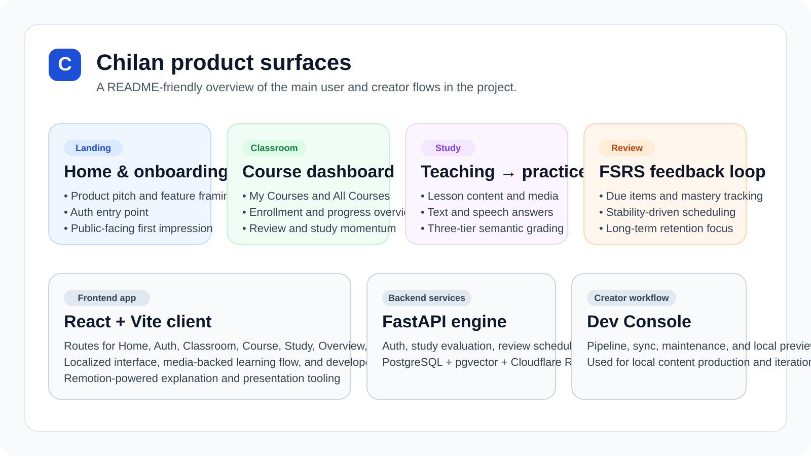
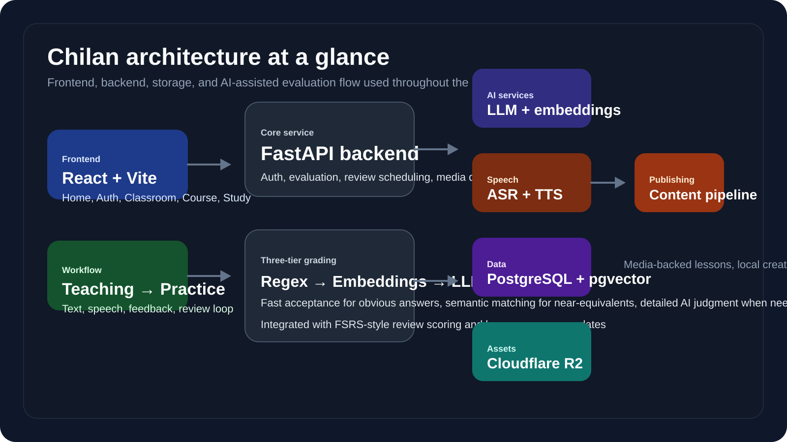

<p align="center">
  
</p>

<h1 align="center">Chilan</h1>

<p align="center">
  <strong>一个以课程为核心的 AI 语言学习平台，结合教材化课时、语义级答案评估、语音练习与 FSRS 复习循环。</strong>
</p>

<p align="center">
  <a href="./README.md">English</a> ·
  <a href="./README.zh.md">简体中文</a> ·
  <a href="https://www.chilanlearning.com">在线站点</a> ·
  <a href="./docs/index.md">文档</a> ·
  <a href="./CONTRIBUTING.md">贡献指南</a>
</p>

<p align="center">
  
  
  
  
  
  
</p>

## 项目简介

Chilan 是一个以课程体系为核心的 AI 语言学习平台，目前围绕中文、英文、日文三条结构化学习路径展开。这个仓库不只是一个学习端网页应用，也包含 FastAPI 后端、公开开发文档，以及面向本地内容生产的项目元数据和工具链。

从产品逻辑上看，Chilan 要解决的是一个很常见的问题：传统字符串精确匹配判题虽然高效，但往往过于僵硬。为此，Chilan 使用 **三层答案评估流程** —— 先做 regex / 规范化匹配，再做 embedding 语义相似度判断，最后才进入 LLM 分析层 —— 从而让明显正确的答案可以快速通过，而语义接近的表达也能得到更合理的反馈。

## 核心亮点

<table>
  <tr>
    <td width="50%" valign="top">
      <strong>🧠 三层语义评测</strong><br />
      Regex 与模式匹配负责快速通过明显正确答案，embedding 用于捕捉语义近似，LLM 则承担更细腻的判断与反馈。
    </td>
    <td width="50%" valign="top">
      <strong>🔁 FSRS 复习循环</strong><br />
      复习调度不是外挂模块，而是学习系统本身的一部分，围绕进度、待复习项目和掌握状态持续运转。
    </td>
  </tr>
  <tr>
    <td width="50%" valign="top">
      <strong>🎙️ 文字 + 语音练习</strong><br />
      学习流程同时支持 typed answer、speech transcription 与 TTS 驱动的互动体验。
    </td>
    <td width="50%" valign="top">
      <strong>📚 结构化课程体系</strong><br />
      Integrated Chinese、New Concept English、Minna no Nihongo 都是组织化学习系统，而不是开放聊天式 prompt 学习。
    </td>
  </tr>
  <tr>
    <td width="50%" valign="top">
      <strong>🖥️ 媒体驱动课时体验</strong><br />
      教学 slides、旁白音频、课程介绍素材与讲解视频工具链共同服务于更完整的 lesson delivery。
    </td>
    <td width="50%" valign="top">
      <strong>🛠️ 本地创作工作流</strong><br />
      除了线上 learner app，项目还包含 pipeline、sync、maintenance、preview 等本地 creator 工具。
    </td>
  </tr>
</table>

## 演示与项目可视化

<p>
  公开站点预览：<a href="https://www.chilanlearning.com">chilanlearning.com</a>
</p>

<table>
  <tr>
    <td align="center" valign="top" width="32%">
      
      <br />
      <sub>公开站点预览素材</sub>
    </td>
    <td align="center" valign="top" width="68%">
      
      <br />
      <sub>README 跟踪资源：概括项目中的主要产品与创作界面</sub>
    </td>
  </tr>
</table>

> 说明：当前公开仓库中的 README 视觉资源已统一放入 `docs/assets/`。大型生成产物和本地专用 pipeline 输出仍然保持不入库。

## 课程体系

| 课程线 | Pipeline ID | 说明 |
| --- | --- | --- |
| Integrated Chinese | `integrated_chinese` | 面向多语言学习者的结构化中文课程 |
| New Concept English | `new_concept_english` | 面向中文学习者的结构化英语课程 |
| Minna no Nihongo | `minna_no_nihongo` | 面向中文学习者的结构化日语课程 |

## 产品流程如何运作

1. **进入 Classroom**  
   学习者登录后浏览课程、报名课程、恢复既有进度。

2. **先学习课时内容**  
   Teaching 模式负责承载 lesson structure、media 和 supporting material。

3. **再进入练习或复习**  
   应用会在 teaching、practice、review、completion 等状态之间切换。

4. **提交文字或语音答案**  
   评估统一通过后端 study flow 执行三层判断。

5. **回到复习循环**  
   复习调度、稳定度和 progress 更新会反馈到 classroom 与 overview 体验中。

## 架构总览

<p align="center">
  
</p>

### 主要组成

- **Frontend：** React 19、Vite 7、Tailwind CSS v4、React Router 7、TanStack Query 5、i18next、Framer Motion、Remotion
- **Backend：** FastAPI、Python 3.13、学习评估服务、复习调度、媒体分发
- **Data：** PostgreSQL 与 pgvector 驱动的语义比较流程
- **Storage：** Cloudflare R2 支持平台资产分发模式
- **更完整的项目工作流：** 本地内容生成与发布工具属于项目工作流的一部分，但大型生成产物不进入版本控制

## 快速开始

### 环境要求

| 工具 | 说明 |
| --- | --- |
| Python 3.13 | 后端运行时 |
| Node.js 20+ | 当前文档中的前端基线版本 |
| PostgreSQL / Neon 兼容数据库 | 应用数据与进度存储 |
| ffmpeg | 仅媒体与渲染工作流需要 |

### 启动后端

先创建 `backend/.env` 并填入所需配置，然后执行：

```bash
cd backend
pip install -r requirements.txt
python main.py
```

健康检查：

```bash
curl http://127.0.0.1:8000/health
```

### 启动前端

```bash
cd frontend
npm install
npm run dev
```

常用前端检查命令：

```bash
npm run build
npm run lint
npm run preview
```

### 重要配置说明

| 领域 | 变量 |
| --- | --- |
| Frontend API | `VITE_APP_API_BASE_URL` |
| Frontend Google OAuth | `VITE_AUTH_GOOGLE_CLIENT_ID` |
| Database | `DB_MODE`、`APP_DATABASE_URL`、`APP_DATABASE_URL_LOCAL` |
| JWT | `SECURITY_JWT_SECRET`、`SECURITY_JWT_ALGORITHM`、`SECURITY_ACCESS_TOKEN_EXPIRE_MINUTES` |
| Storage | `STORAGE_R2_ACCOUNT_ID`、`STORAGE_R2_ACCESS_KEY_ID`、`STORAGE_R2_SECRET_ACCESS_KEY`、`STORAGE_R2_BUCKET` |
| Speech | `ASR_PROVIDER`、`ASR_OPENAI_API_KEY` 或 `LLM_OPENAI_API_KEY` |
| Mail | `MAIL_PROVIDER` 与 `MAIL_SMTP_*` / `MAIL_RESEND_*` |

> 当前仓库没有提交 `backend/.env.example`，所以本地环境配置仍以代码和文档为准。

## 仓库结构

| 路径 | 角色 |
| --- | --- |
| `frontend/` | React/Vite 学习端应用 |
| `backend/` | FastAPI 服务、评估逻辑、复习调度与数据库工具 |
| `docs/` | 对外公开的开发文档和 README 资源 |
| `docs/assets/` | README 与公开文档使用的跟踪视觉资源 |
| `CONTRIBUTING.md` | 贡献指南 |
| `LICENSE` | MIT 许可 |

## 项目状态

**Status：Active development**

核心学习流程、语义判题模型、复习管线以及本地 creator 工具链都在持续迭代中。公开文档和仓库体验也在逐步完善，因此贡献者可以预期实现细节与内部工作流仍会继续变化。

## Roadmap

项目当前的近期方向包括：

- 提升判题与复习逻辑的重要行为覆盖度，
- 优化多语言与语音练习体验，
- 继续加固后端评估与数据流，
- 改善贡献者体验和公开文档质量，
- 让本地 content-and-publishing workflow 更容易理解和维护。

## Contributing

欢迎提交 Pull Request。

如果你想参与贡献：

- 先阅读 [CONTRIBUTING.md](CONTRIBUTING.md)，
- 对于较大的改动，建议先开 issue 或 discussion，
- 并在 PR 中清楚说明行为变化、测试方式以及文档更新情况。

涉及 grading logic、review scheduling、course flow 的改动尤其需要清晰解释其用户影响。

## License

本仓库采用 [MIT License](LICENSE)。

## 文档入口

如果你想继续深入技术细节，可以从这里开始：

- [文档索引](docs/index.md)
- [项目概述](docs/project-overview.md)
- [开发指南](docs/development-guide.md)
- [前端架构](docs/architecture-frontend.md)
- [后端架构](docs/architecture-backend.md)
- [集成架构](docs/integration-architecture.md)
- [源码目录树](docs/source-tree-analysis.md)

## 备注

- “界面支持多语言”和“课程覆盖哪些语言组合”不是同一件事。
- README 视觉资源现在统一位于 `docs/assets/`，不再直接引用本地 `poster/` 工作目录。
- 一些本地 creator 工具和大型生成产物仍然有意保持不入库。
