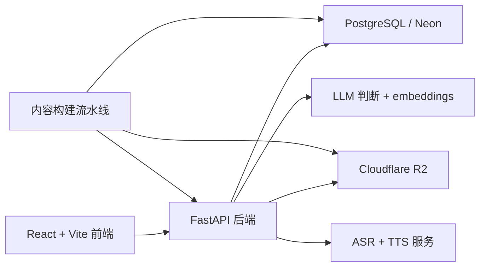

<p align="center">
  
</p>

<h1 align="center">Chilan</h1>

<p align="center">
  <strong>一个以课程为核心的 AI 语言学习平台，结合结构化课时、语义级答案评估、语音练习与 FSRS 间隔复习。</strong>
</p>

<p align="center">
  <a href="./README.md">English</a> · <a href="./README.zh.md">简体中文</a>
</p>

<p align="center">
  
</p>

## 项目简介

Chilan 是一个以课程体系为核心的 AI 语言学习平台，当前围绕中文、英文和日文三条结构化学习路径展开。这个仓库不只是一个学习端网页应用，还同时包含了 FastAPI 后端，以及一套离线内容生产流水线，用来把教材源内容转成 JSON、音频、幻灯片和可发布的学习资产。

和只依赖“精确字符串匹配”的传统判题方式不同，Chilan 使用三层答案评估机制：先做精确 / 模式匹配，再做 embedding 相似度判断，最后才进入 LLM 深度判断。这样可以在明显正确的情况下保持速度，又能在答案“语义接近但不完全同形”时保留足够的判断弹性，并只在真正需要时生成更细致的反馈。

## 为什么要做 Chilan

很多语言学习产品擅长检查模板答案，却不擅长处理“表达方式不同但意思接近”的回答。如果学习者换了一种说法，系统往往会过早判错。Chilan 的目标就是降低这类误判，但又不把每一道题都变成高成本的 LLM 推理。

这意味着平台会尽量做到：

- 对显然正确的答案快速放行，
- 对语义接近但不完全同形的答案保留容错空间，
- 只有在确实需要更细致判断时，才进入 LLM 反馈层。

## 核心亮点

### 1）三层答案评估

| 层级 | 作用 | 价值 |
| --- | --- | --- |
| Tier 1 | Regex / 模式匹配 | 快速接受明显正确或规范化后等价的答案 |
| Tier 2 | Embedding 相似度 | 捕捉超出字符串匹配范围的语义接近答案 |
| Tier 3 | LLM 判断 | 在前两层不够时给出更细腻的判断与反馈 |

### 2）结构化学习流程

- 基于课程体系，而不是纯开放聊天式学习
- Teaching → Practice / Review → Completion 的学习闭环
- 课时进度、复习队列与完成状态跟踪
- 中文路径下还有独立的 **课程介绍**、**汉字**、**拼音**、**打字** 基础页面

### 3）媒体驱动的课时体验与语音支持

- 教学内容可以绑定音频与媒体素材
- 后端提供拼音音频、课程介绍音频、教学旁白和教学幻灯片媒体
- 学习流程中支持语音转写与 TTS
- 还支持基于 Remotion 的讲解视频渲染能力

### 4）FSRS 间隔复习

- 复习调度是产品内建能力，而不是事后补上的功能
- 通过 classroom / overview 暴露待复习、进度与掌握状态
- 让学习体验围绕稳定度和掌握度持续推进

### 5）多语言界面

- 当前 UI 代码层面支持 **15 种界面语言**
- 这里说的是界面本地化，不等于每门课程都覆盖所有语言组合

<details>
<summary>当前界面语言列表</summary>

- 简体中文
- English
- 日本語
- Français
- Deutsch
- 한국어
- Español
- Tiếng Việt
- Português
- العربية
- ไทย
- Русский
- Bahasa Indonesia
- Bahasa Melayu
- Italiano

</details>

## 课程体系

| 课程线 | Pipeline ID | 说明 |
| --- | --- | --- |
| Integrated Chinese | `integrated_chinese` | 面向多语言学习者的结构化中文课程 |
| New Concept English | `new_concept_english` | 面向中文学习者的结构化英语课程 |
| Minna no Nihongo | `minna_no_nihongo` | 面向中文学习者的结构化日语课程 |

## 学习流程是怎样运作的

1. **登录并进入 Classroom**  
   学习者浏览课程、报名课程，并从上次中断的位置继续。

2. **先学习课时内容**  
   Teaching 模式负责承载课时结构、音频和配套媒体。

3. **再进入练习或复习**  
   学习页面会在 teaching、practice、review、completed 等状态之间切换。

4. **提交文字或语音答案**  
   所有答案统一进入 `/study/evaluate` 的三层评估流程。

5. **按 FSRS 节奏复习**  
   待复习题目、学习进度和掌握状态会回流到 classroom 与 overview 页面。

## 架构总览



### 技术栈

- **前端：** React 19、Vite 7、Tailwind CSS v4、React Router 7、TanStack Query 5、i18next、Framer Motion、Remotion
- **后端：** FastAPI、Python 3.13、psycopg2、PostgreSQL、Cloudflare R2、语音服务、AI 辅助评估
- **内容工具链：** 离线课时生成、旁白渲染、幻灯片 / 视频渲染与发布流程

## 快速开始

### 环境要求

| 工具 | 说明 |
| --- | --- |
| Python 3.13 | 后端运行需要 |
| Node.js 20+ | 当前文档中的前端基线版本 |
| PostgreSQL / Neon 兼容数据库 | 应用数据存储需要 |
| ffmpeg | 仅视频 / 内容渲染相关工作流需要 |

### 1）启动后端

先创建 `backend/.env` 并填入你需要的配置，再执行：

```bash
cd backend
pip install -r requirements.txt
python main.py
```

后端健康检查：

```bash
curl http://127.0.0.1:8000/health
```

### 2）启动前端

```bash
cd frontend
npm install
npm run dev
```

常用前端命令：

```bash
npm run build
npm run lint
npm run preview
```

### 3）关键配置说明

当前仓库代码实际使用的环境变量包括：

| 领域 | 变量 |
| --- | --- |
| Frontend API | `VITE_APP_API_BASE_URL` |
| Frontend Google OAuth | `VITE_AUTH_GOOGLE_CLIENT_ID` |
| Database | `DB_MODE`、`APP_DATABASE_URL`、`APP_DATABASE_URL_LOCAL` |
| JWT | `SECURITY_JWT_SECRET`、`SECURITY_JWT_ALGORITHM`、`SECURITY_ACCESS_TOKEN_EXPIRE_MINUTES` |
| Storage | `STORAGE_R2_ACCOUNT_ID`、`STORAGE_R2_ACCESS_KEY_ID`、`STORAGE_R2_SECRET_ACCESS_KEY`、`STORAGE_R2_BUCKET` |
| Speech | `ASR_PROVIDER`、`ASR_OPENAI_API_KEY` 或 `LLM_OPENAI_API_KEY` |
| Mail | `MAIL_PROVIDER` 以及 `MAIL_SMTP_*` 或 `MAIL_RESEND_*` |

> 仓库当前没有提交 `backend/.env.example`，所以本地配置时请以当前代码和 `docs/` 文档为准。

## 内容流水线与媒体工具

除了在线学习产品本身，这个仓库还包含位于 `backend/content_builder/` 的离线内容生产系统，用于把教材源内容转换为可发布的课时资产。

典型流程包括：

- 课时 / JSON 发布
- 旁白生成
- 幻灯片 / 讲解视频渲染
- 媒体上传并同步到 PostgreSQL + Cloudflare R2

相关命令示例：

```bash
cd backend
python database/sync_to_db.py
```

```bash
cd frontend
node scripts/render-explanation-video.mjs 101
# 或
node scripts/render-explanation-video.mjs <lessonId> [lang] [pipelineId]
```

## 仓库结构

```text
.
├─ frontend/                 # React/Vite 学习端应用
│  ├─ src/
│  │  ├─ pages/              # Home、auth、classroom、course、study、overview、settings
│  │  ├─ api/                # Axios 客户端与 query 定义
│  │  └─ videoTemplates/     # 基于 Remotion 的教学 / 讲解组件
├─ backend/                  # FastAPI API、学习服务、存储、数据库同步
│  ├─ routers/               # 认证与学习路由
│  ├─ services/              # 评估、调度、语音、存储、维护逻辑
│  ├─ database/              # 连接与同步脚本
│  └─ content_builder/       # 离线课时生成与发布流水线
├─ docs/                     # 架构与开发文档
└─ poster/                   # 项目展示素材
```

## 文档导航

如果你想继续深入，可以从这些文档开始：

- [文档索引](docs/index.md)
- [项目概述](docs/project-overview.md)
- [开发指南](docs/development-guide.md)
- [前端架构](docs/architecture-frontend.md)
- [后端架构](docs/architecture-backend.md)
- [集成架构](docs/integration-architecture.md)
- [源码目录树](docs/source-tree-analysis.md)

> 当前 `docs/` 下的大多数深度技术文档以中文为主。

## 说明

- 这份 README 聚焦于当前已核实的产品能力与仓库结构。
- “界面支持 15 种语言”与“课程覆盖哪些语言组合”不是一回事。
- 这里统一将项目名称写作 **Chilan**。
